# Delving-into-the-World-of-Nobel-Prizes(1901-2023):An-Examination-Using-SQL

*Note: The SQL code for this project can be found above named **Nobel_Laureates.sql***

## ABOUT THE PROJECT

This project is centred on Nobel laureates' datasets, and my primary goal is to enhance my proficiency in comprehending and responding 
to questions to provide the expected answer by writing SQL queries.

This project serves as a dynamic platform to elevate my SQL skills, allowing me to navigate the complexities of data analysis.

By delving into the rich dataset through data exploration and analysis, I aim to uncover hidden patterns and insightful connections within the Nobel laureates' landscape (this includes the individuals themselves, their fields of expertise, their contributions to society, and the various institutions and organisations associated with them), fostering a deeper understanding of their diverse experiences and contributions.

## DATASET

The Nobel laureates datasets contains the following columns:

- Year of award
- Category
- Motivation
- Prize share
- Laureate id
- Full name
- Gender
- Born
- Born country
- Born city
- Died
- Died country
- Died city
- Organization name
- Organization country
- Organization city

## DATA PROCESSES INVOLVED

- Data exploration
- Data cleaning
- Data preprocessing
- Handling missing values
- Data documentation

  ## SQL COMMANDS AND FUNCTIONS USED:

- DATA DEFINITION LANGUAGE: CREATE TABLE, ALTER TABLE
- DATA MANIPULATION LANGUAGE: SELECT, GROUP BY, WHERE,HAVING, ORDER BY, LIMIT, JOIN
- AGGREGATE FUNCTIONS: AVG(), COUNT()
- STRING FUNCTIONS: SUBSTRING()
- STRING COMPARISON FUNCTION: LIKE
- MATHEMATICAL FUNCTION: CEILING()
- LOGICAL FUNCTIONS: CASE
- SUBQUERY
- COMMON TABLE EXPRESSIONS (CTEs)
- WINDOW FUNCTIONS: RANK()
- DATE FUNCTION: EXTRACT()

ANALYSIS & QUESTIONS 

*Note: The SQL code for this project can be found above named **Nobel_Laureates.sql***

A. Extracting Basic Information:

(1) Retrieve the total number of awards.

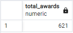

(2) Retrieve the number of Nobel Laureates by gender with the total number of Laureates.

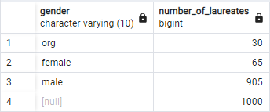

--Note that org in the gender column represents organization.

(3) List the distinct categories (e.g., physics, chemistry, peace) of Nobel Prizes.

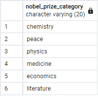

B. Time-based Analysis:

(4) Identify the laureate(s) who received the earliest Nobel Prize.

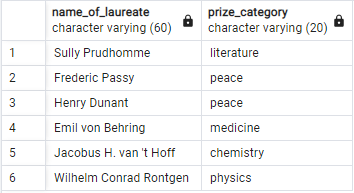

(5) Identify the laureate(s) who received the latest Nobel Prize.

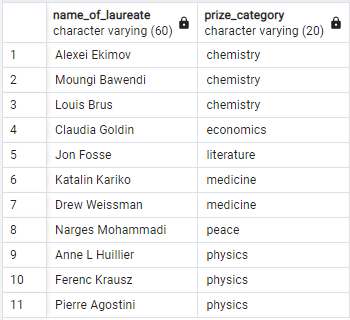

(6) Supply the number of years in which the number of prize categories given ranges from one to six.

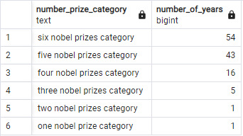

(7) Get the number of years in which no Nobel Prize was awarded at all.

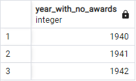

C. Prize Category-based Analysis:

(8) Determine the Nobel Prize category with the number of laureates from highest to lowest.

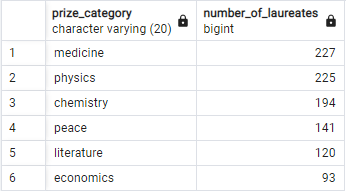

(9) Find out which category has the highest average age for the deceased laureates.

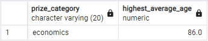

D. Country-based Analysis:(Note that this was calculated based on the country the laureates were born)

(10) List the top 10 countries with the most Nobel laureates.

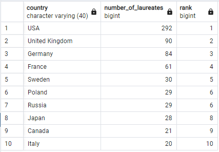

E. Gender-based Analysis:

(11) Calculate the percentage of Nobel Prizes awarded to males, females, and organisations.

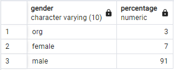

(12) Identify the first three categories with the highest number of female laureates.

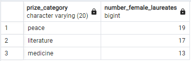

F. Age-based Analysis: (Note that this section was performed based on the laureates' year of birth and year of award.)

(13) Determine the average age of Nobel laureates.

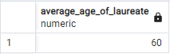

(14) Obtain the age and other relevant information about the youngest Nobel Laureate.

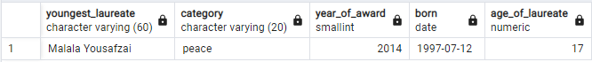

(15) Obtain the age and other relevant information about the oldest Nobel Laureate.

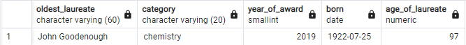

(16) Calculate the average age of Nobel laureates for each category and present the result alongside the category names.

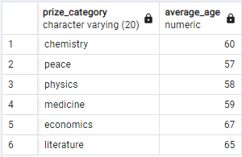

G. Multiple Prize Winners:

(17) Identify the laureate(s) who have won Nobel Prizes in multiple prize categories.

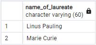

(18) Identify the laureate(s) who have received more than one Nobel Prize.

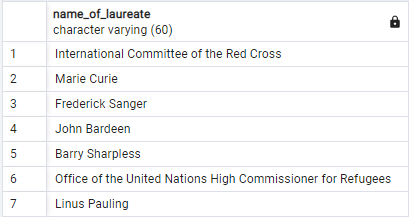

(19) Identify the laureate(s) with the multiple prize award in each category.

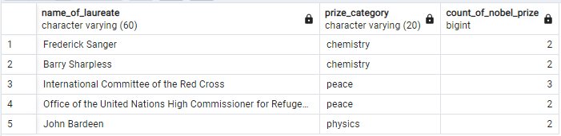

H. University-based Analysis:

(20) Determine which university has produced the most Nobel laureates.

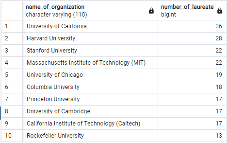

(21) Identify laureates who were affiliated with multiple universities.

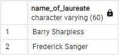

I. Pattern Matching:

(22) Identify the number of laureates who were born and died in different countries.

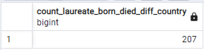

(23) Identify the number of laureates who were born and died in the same country.

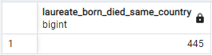

(24) Identify Nobel laureates who are part of the same family or are siblings.

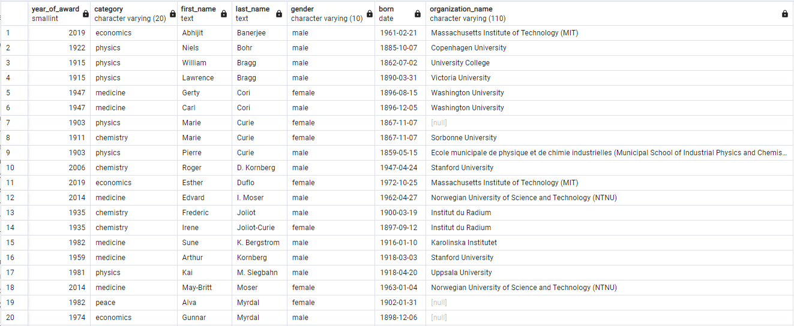

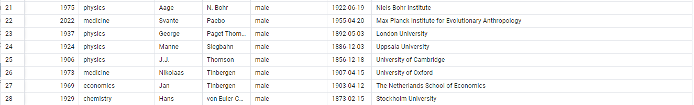

J. Mortality Rate Analysis

(25) Provide the percentage of the deceased laureates.(Note:This calculation is based on the dataset used in this case study)

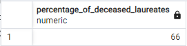

 ## CONCLUSION
 
In alignment with the project's objectives, it has functioned as a magnifying lens, offering a closer examination of the Nobel laureates' landscape. This encompassed not only the laureates as individuals but also delved into their respective fields of expertise, societal contributions, and the diverse organizations linked to them. The project has played a pivotal role in enhancing the comprehension of their varied experiences and significant contributions.

Also, this website[Click_here.](https://www.nobelprize.org/prizes/facts/nobel-prize-facts/) served as a guide while performing the analysis.

*Note: The SQL code for this project can be found above named **Nobel_Laureates.sql***
